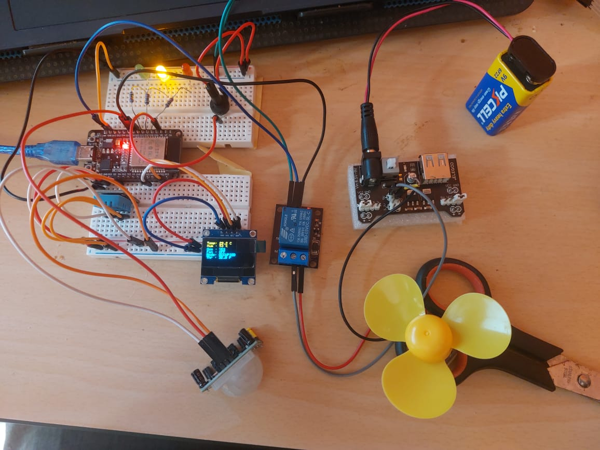
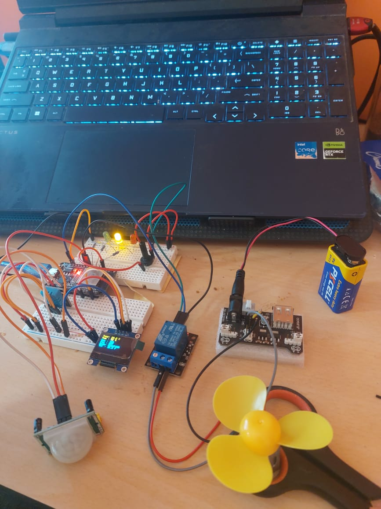

# Smart Classroom Comfort Controller

## Team

- El Hadji Malick Niang
- Moustapha Lo
- Amadou Hanne
- Fallou Ndour

## Overview

This project is an IoT classroom automation prototype built around an `ESP32`. It monitors temperature, humidity, and occupancy, then decides whether a classroom fan should run. The system also provides local feedback on an `OLED`, publishes telemetry through `MQTT`, stores readings in `SQLite`, and shows live status in a `Flask` dashboard.

Main functions:

- read temperature and humidity from a `DHT11`
- detect occupancy with a `PIR` sensor
- control a fan through a `relay`
- indicate comfort state with `green`, `yellow`, and `red` LEDs
- display live values on an `OLED`
- publish telemetry over `MQTT`
- log readings and alerts in `SQLite`
- visualize system state in a web dashboard

## Prototype Photos

Working hardware prototype:



Closer view of the wiring, OLED, relay, and fan section:



## Repository Contents

- [ESP32 firmware](esp32_mqtt_attributes__1_/esp32_mqtt_attributes__1_.ino)
- [Flask dashboard backend](dashboard_app.py)
- [Dashboard template](templates/index.html)
- [Requirements](requirements.txt)
- [Dashboard launcher](start_dashboard.bat)
- [Demo control menu](demo_menu.bat)
- [Final report](FINAL_REPORT.md)
- [Project report document](IoT_Student_Projects.docx)
- [Sample SQLite database](classroom.db)
- [Private config template](dashboard.local.env.example.bat)

## Hardware

- `ESP32`
- `DHT11`
- `PIR sensor`
- `OLED display`
- `1-channel relay module`
- `green LED`
- `yellow LED`
- `red LED`
- `potentiometer`
- `3 resistors`
- breadboard
- jumper wires

## Wiring

- `DHT11 S` -> `GPIO 4`
- `PIR OUT` -> `GPIO 27`
- `Relay IN` -> `GPIO 26`
- `Green LED` -> `GPIO 25`
- `Yellow LED` -> `GPIO 33`
- `Red LED` -> `GPIO 32`
- `Potentiometer OUT` -> `GPIO 34`
- `OLED SDA` -> `GPIO 21`
- `OLED SCL` -> `GPIO 22`

Shared connections:

- all grounds -> `ESP32 GND`
- `OLED VCC` -> `3V3`
- `DHT11 VCC` -> `3V3`
- `PIR VCC` -> `3V3`
- `Relay VCC` -> `VIN / 5V`
- potentiometer side pins -> `3V3` and `GND`

## Control Logic

- if the room is occupied and the temperature is above the threshold, the fan turns on
- if the room is occupied and the temperature is below the threshold, the fan stays off
- if the room becomes empty, the fan can keep running during the vacancy timeout
- after the vacancy timeout, the fan turns off automatically
- the threshold is set from the hardware `potentiometer`
- if the temperature stays above the threshold for more than `5 minutes`, the Python side logs a high-temperature alert

Comfort colors:

- `green` = comfortable
- `yellow` = warm
- `red` = hot

## MQTT Topics

- `niang-lo-hanne-ndour/classroom/comfort/telemetry`
- `niang-lo-hanne-ndour/classroom/comfort/status/fan`
- `niang-lo-hanne-ndour/classroom/comfort/status/occupancy`
- `niang-lo-hanne-ndour/classroom/comfort/status/comfort`
- `niang-lo-hanne-ndour/classroom/comfort/status/state`
- `niang-lo-hanne-ndour/classroom/comfort/status/threshold`
- `niang-lo-hanne-ndour/classroom/comfort/config/system_mode`

## Setup

### ESP32

1. Open [esp32_mqtt_attributes__1_.ino](esp32_mqtt_attributes__1_/esp32_mqtt_attributes__1_.ino) in Arduino IDE.
2. Install `PubSubClient`, `DHT sensor library`, `Adafruit GFX Library`, and `Adafruit SSD1306`.
3. Select the board `ESP32 Dev Module`.
4. Select the correct COM port.
5. Replace the Wi-Fi and MQTT placeholders in the sketch with your own private values.
6. Upload the sketch.

### Python Dashboard

Install dependencies:

```powershell
pip install -r requirements.txt
```

Optional private MQTT config:

1. Create `dashboard.local.env.bat` in the project root.
2. Copy the values from [dashboard.local.env.example.bat](dashboard.local.env.example.bat).
3. Fill in your real MQTT host, port, username, and password.

## Run

1. Start the dashboard with [start_dashboard.bat](start_dashboard.bat).
2. Open [http://127.0.0.1:5000](http://127.0.0.1:5000).
3. Power the ESP32 and verify that telemetry is arriving.

For demonstrations, [demo_menu.bat](demo_menu.bat) can switch the system between:

- real mode
- empty and cool
- occupied and comfortable
- occupied and warm
- occupied and hot

## Alerts And Data

- readings are stored in [classroom.db](classroom.db)
- the dashboard shows recent telemetry and 24-hour trend data
- high-temperature alerts are logged after `5` continuous minutes above threshold

## Quick Demo Checklist

- ESP32 is powered
- OLED is active
- Wi-Fi or broker access is available
- dashboard is running
- browser is open on `http://127.0.0.1:5000`
- `demo_menu.bat` is ready if live conditions are not ideal

## Troubleshooting

1. Check the ESP32 Serial Monitor first.
2. Confirm Wi-Fi and MQTT connectivity.
3. Restart the dashboard.
4. Refresh the browser.
5. Use `demo_menu.bat` to verify demo control messages.
